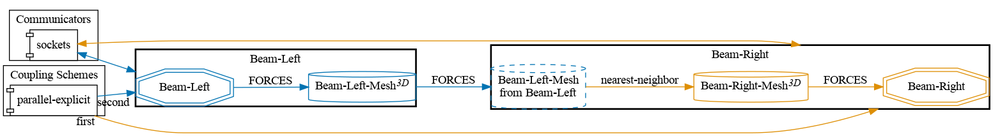

# Partitioned beam: Uni-directional coupling (forces)

This is a uni-directional coupling, in which the left (loaded) participant sends forces to the right participant.



## How to run

1. Install OpenRadioss and set the `OPENRADIOSS_PATH` in your environment (includes the `starter/` and `engine/` directories)
2. Install the `anim_to_vtk` in `OPENRADIOSS_PATH/exec`
3. Open two terminals and execute the `run.sh` scripts:

   ```sh
   # Terminal 1
   cd beam-left-openradioss
   ./run.sh

   # Terminal 2
   cd beam-right-openradioss
   ./run.sh
   ```

   These scripts rely on the `../tools/setup-openradioss.sh` script.

## State

This coupling has been tested for two different variants:
- `Radioss-Radioss` with `time-window-size = 1e-1` - **Case runs well and completes**;
- `Radioss-Radioss` with `time-window-size = 1e-2` - **Case runs**, but **completes only for the** `Beam-Left` **partecipant**. `Beam-Right` **partecipant** hangs within the coupling starting from `time-window-size = 99`.
  
  - In addition to that, _some instabilities are observed_ (https://github.com/elisa-santoro/openradioss-cases/issues/12) when post-processing the **temporal evolution of forces being written** by `Beam-Left`.

It's believed that the **reason for these instabilities to occur** lies in the _out-of-syncronization between Radioss solvers_ (both using an _adaptive time step_) _and preCICE_. To be further discussed in my thesis:
- Concept of **subcycling**: for how the coupling Library is configured, preCICE would _only allow one Radioss partecipant to have a smaller time step smaller than the_ `time-window-size`. When both solvers resort to subcycling, the observed instability comes up.
- More on this matter here: [Subcycling in preCICE](https://precice.org/couple-your-code-waveform) + `preCICE Documentation Manual`.

## Results

`time-window-size = 1e-1`


The **writing FORCES** from `Beam-Left` to preCICE appears to be correct throughout the whole simulation.


There seems to be a correspondence between the **FORCES written** and the **FORCES read** inside preCICE throughout the whole simulation. 
- Larger spheres = Forces written by `Beam-Left` to preCICE;
- Smaller spheres = Forces read from preCICE by `Beam-Right`; 
##
`time-window-size = 1e-2`

https://github.com/user-attachments/assets/4e1fa30a-f3da-4f8c-94c1-579bf1534f2d

The **writing FORCES** from `Beam-Left` to preCICE appears to be correct for the first 2 seconds of the simulation, then _instability within the partecipant occurs_. 

Setting two watchpoints on the spheres for `P = (0.25, 0.4, 6) [m]` and `Q = (0.25, 0.1, 6) [m]`, it is possible to plot the _temporal evolution of the total force on the Y-Direction_: the following plots are obtained.


-

For the first two seconds of the simulation, everything matches as shown below (where it is also possible to observe `Beam-Right` hanging for `t = 0.99 s`).


-

Later on, a clear specular discrepancy between the values registered along these two watch-points becomes apparent, and the total force along the Y-Direction continues to increase in magnitude causing instability. 


