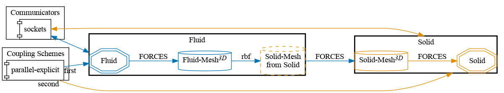

# Perpendicular flap: 3D Uni-Directional Coupling (FORCES)

This is a variant of the [perpendicular flap tutorial](https://precice.org/tutorials-perpendicular-flap.html) in 3D and with explicit coupling, where a **uni-directional coupling** is implemented with the `Fluid` participant sending **FORCES** to the `Solid` one.

The modifications pertaining the 3D nature of the domain, as well as the explicit coupling scheme choice, come from current restrictions in the OpenRadioss setup (and the fact that OpenRadioss is an explicit solver).



## How to run

1. Install OpenRadioss and set the `OPENRADIOSS_PATH` in your environment (includes the `starter/` and `engine/` directories)
2. Install the `anim_to_vtk` in `OPENRADIOSS_PATH/exec`
3. Install [OpenFOAM](https://www.openfoam.com/) the [OpenFOAM adapter](https://precice.org/adapter-openfoam-overview.html) (v1.4.0 or later)
3. Open two terminals and execute the `run.sh` scripts:

   ```sh
   # Terminal 1
   cd fluid-openfoam
   ./run.sh

   # Terminal 2
   cd solid-openradioss
   ./run.sh
   ```

   The scripts rely on tools found in `../tools/`.

## State and results

The simulation completes (currently configured to run up to t=0.5s), and it is possible to observe the `Solid` element to displace accordingly to the FORCES sent to him by the `Fluid` participant.

Since the coupling is **not** configured to send DISPLACEMENTS back from the `Solid` participant to the `Fluid`, no displacement is observed within the `Fluid-Mesh`. 
