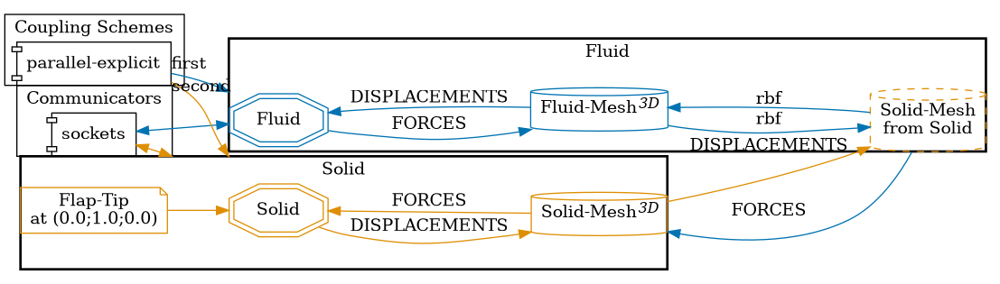

# Perpendicular flap: 3D

This is a variant of the [perpendicular flap tutorial](https://precice.org/tutorials-perpendicular-flap.html) in 3D and with explicit coupling.
These modifications only come from current restrictions in the OpenRadioss setup (and the fact that OpenRadioss is an explicit solver).



## How to run

1. Install OpenRadioss and set the `OPENRADIOSS_PATH` in your environment (includes the `starter/` and `engine/` directories)
2. Install the `anim_to_vtk` in `OPENRADIOSS_PATH/exec`
3. Install [OpenFOAM](https://www.openfoam.com/) the [OpenFOAM adapter](https://precice.org/adapter-openfoam-overview.html) (v1.4.0 or later)
3. Open two terminals and execute the `run.sh` scripts:

   ```sh
   # Terminal 1
   cd fluid-openfoam
   ./run.sh

   # Terminal 2
   cd solid-openradioss
   ./run.sh
   ```

   The scripts rely on tools found in `../tools/`.

## State and results

The simulation completes (currently configured to run up to t=0.5s), and it is possible to observe that the **fluid-induced forces transferred through the coupling** cause the **solid flap to deflect with a tip displacement on the order of** `2.0 e-01 m`.

Since the counter-coupling of displacements from the `Solid` to the `Fluid` participant also seem to be successful, it is possible to see that the `Fluid-Mesh` moves as well accordingly to the solid flap deflection.
