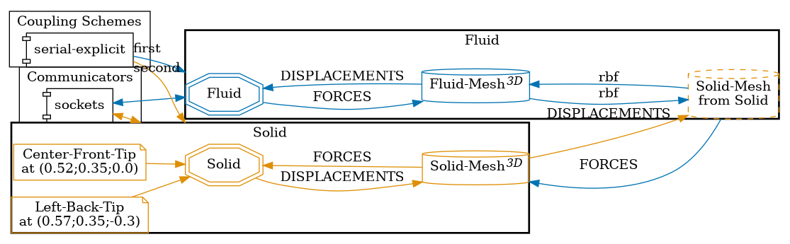

# Pulsating Flow over Flexible Flap: 3D FSI Coupling Test Case

This is a variant of the "Pulsating flow over flexible flap" test case discussed in the [OpenFOAM adapter validation paper](https://journal.openfoam.com/index.php/ofj/article/view/88/78) where the `Solid`
participant is modelled in OpenRadioss.

Given the current restrictions presented when interfacing OpenRadioss (an explicit solver) to the preCICE coupling library, the `coupling-scheme` choice implemented in this repository 
fell on a `parallel-explicit` configuration over the `parallel-implicit` scheme implemented in the paper mentioned above. 



## Mesh Configuration

The test case implemented within this repository implements what the [OpenFOAM adapter validation paper](https://journal.openfoam.com/index.php/ofj/article/view/88/78) refer to as `coarse` mesh.

This means the `Solid` participant modelled in OpenRadioss is discretized with 48 `HEX20` solid elements, arranged with a 2 x 4 x 6 cell resolution along the three spatial directions.

## How to run

1. Install OpenRadioss and set the `OPENRADIOSS_PATH` in your environment (includes the `starter/` and `engine/` directories)
2. Install the `anim_to_vtk` in `OPENRADIOSS_PATH/exec`
3. Install [OpenFOAM](https://www.openfoam.com/) the [OpenFOAM adapter](https://precice.org/adapter-openfoam-overview.html) (v1.4.0 or later)
3. Open two terminals and execute the `run.sh` scripts:

   ```sh
   # Terminal 1
   cd fluid-openfoam
   ./run.sh

   # Terminal 2
   cd solid-openradioss
   ./run.sh
   ```

   The scripts rely on tools found in `../tools/`.

## State and results

The simulation completes, and the results are as follows:

#### Simulation setup at `t= 2.5 s`


#### Cross-section of the computational domain at `z= 0 m` and `t= 2.5s`


#### Cross-section of the computational domain at `z= 0 m`: Temporal Evolution

https://github.com/user-attachments/assets/93a2f6d9-3868-43ab-ae0d-e25be37def33

#### Watchpoints post-processing

Central WatchPoint


Left WatchPoint


